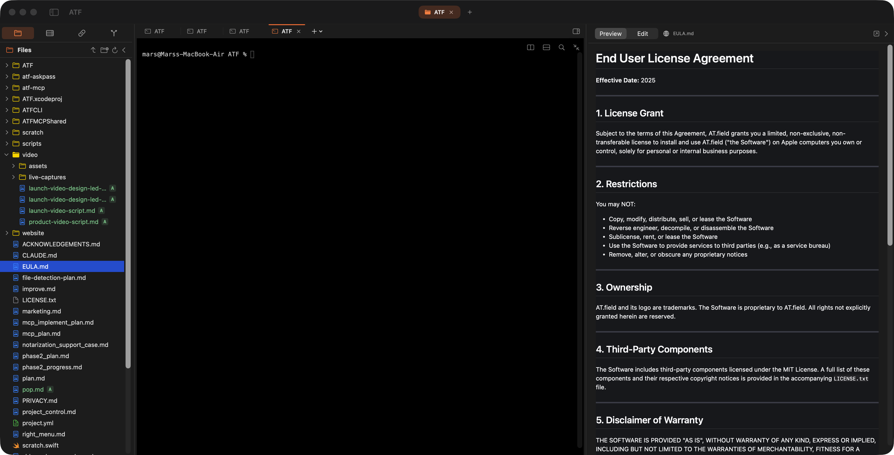

# AT.field — AI Terminal Field

> **Expand your AT.field. Visualize the Future of AI.**

## AT.field とは？

従来のターミナルではありません。また別の Electron IDE でもありません。

**AT.field は、Claude Code、Codex CLI、Gemini CLI、aider、SSH、Serial port、Git diff、localhost preview、AI Agent ワークフローを統合する macOS ネイティブ AI terminal cockpit です。**

キーワード：macOS AI terminal、Claude Code terminal、Codex CLI GUI、AI CLI cockpit、file preview 付き terminal、SSH manager、Serial port terminal、UART console、localhost preview、Git diff viewer、MCP server、AI agent workflow。

多くのエンジニアがすでに **Claude Code、Codex CLI、aider、OpenHands、Antigravity、Gemini CLI** を使っています — しかし、すべて同じ問題に直面しています。

核心はシンプルです：

- **AI CLI（Claude Code、Codex、Antigravity CLI）** が実行を担当
- **人間** が Sidecar ビジュアルレイヤーを通じて監督・レビュー
- **3ペインインターフェース** がファイルナビゲーション、メインターミナル、AI結果の可視化を同時管理

AI CLI ツールの最大の痛点を解決します：**CLI が「盲目的」すぎる。**

AI は強力ですが、スクロールするテキストを見るしかできません。以下のことを素早く行えません：

- diff を見る
- Markdown を表示する
- localhost ページを開く
- 画像/PDF を表示する
- git 変更を確認する
- リモート機器の状態を確認する

AT.field の答え：**terminal-first のワークフローを維持しつつ、視覚的な Sidecar を並置する。**

## なぜ純粋な CLI ワークフローだけでは足りないのか？

AI CLI は、コマンド実行、ファイル編集、テスト実行、サービス起動に非常に向いています。しかし明確な制約があります：**基本的にはテキストインターフェースであることです。**

Claude Code、Codex CLI、または他の agent がターミナル内で「ファイルを更新した」「レポートを生成した」「localhost サービスを起動した」「diff を出力した」と伝えてきても、その結果を CLI の中だけで快適に確認するのは簡単ではありません。

例えば：

- agent が `src/App.swift` を更新する
- agent が `report.md` を生成する
- agent が `http://localhost:3000` を起動する
- agent が diff を出力する
- agent が画像や PDF を作成する
- agent が git 変更の確認を求める

純粋な terminal ワークフローでは、通常さらに多くの操作が必要になります：

- `cat`、`less`、`vim`、`nano` でファイルを開く
- `!` や shell コマンドで外部ツールを呼び出す
- Finder に切り替えてファイルを探す
- ブラウザに切り替えて localhost を開く
- VS Code / Cursor に切り替えて diff を見る
- Preview に切り替えて画像や PDF を見る
- もう一度 terminal に戻って AI との対話を続ける

これらの操作自体は難しくありません。しかし、ワークフローを何度も中断します。

AI CLI の問題は「作業ができない」ことではありません。問題は、**AI が作業を終えたあと、人間が同じ場所で結果を素早く理解し、確認し、修正しにくいことです。**

AT.field はこの層を補います。terminal にファイルパス、localhost URL、Markdown、画像、PDF、HTML、diff が出てきたとき、AT.field はそれらを右側の Sidecar で直接開けます。terminal から離れたり、Finder、ブラウザ、Preview、VS Code の間を何度も行き来したりする必要はありません。

これにより、AI CLI は「テキストだけを出力するブラックボックス」ではなく、リアルタイムに観察・レビューできるワークフローになります。

## すべての terminal 作業を一つの場所で

AT.field は AI CLI を実行するためだけのツールではありません。エンジニアが日常的に terminal 周辺で行う作業を、一つのワークスペースにまとめることを目指しています：

- ローカル shell
- AI CLI / coding agent
- SSH リモートホスト
- Serial port / UART デバイス
- localhost web preview
- Markdown / PDF / image / HTML preview
- Git diff とファイル変更レビュー
- 長時間実行される script、server、log tail
- MCP / automation integration

通常、これらの作業は iTerm2、Finder、VS Code、ブラウザ、Preview、SSH config、serial console ツール、git GUI などに分散しています。

AT.field はそれらを一つの3ペインインターフェースに戻します：

- 左：プロジェクト、ファイル、接続、session を管理
- 中央：terminal、AI CLI、SSH、Serial を実行
- 右：出力プレビュー、ファイル内容、diff、localhost ページ、メディアファイルを表示

同じウィンドウ内で、コマンド実行、リモートマシン接続、AI の変更確認、localhost 確認、git diff レビュー、Markdown レポート表示、serial log 監視を行えます。

## SSH と Serial を第一級ワークフローとして扱う

多くの terminal app は SSH を主要機能として扱いますが、Serial port は外部ツール任せになりがちです。embedded、robotics、homelab、infrastructure の作業では、それだけでは不十分です。

実際のプロジェクトでは、次のような作業が同時に必要になることがあります：

- リモート Linux server に SSH する
- Raspberry Pi、Jetson、router、NAS、dev board に接続する
- `/dev/tty.*` 経由で UART / serial console 出力を見る
- ローカル build を実行しながら log を tail する
- AI CLI にコードを修正させながら、リモートマシンでテストする
- ローカル、SSH、Serial session にファイルをドラッグする

AT.field は SSH と Serial を同じレベルの session として扱います。

同じ接続ハブで SSH host と Serial device を管理できます。tab を切り替えてもバックグラウンド接続は切断されません。session をフローティングウィンドウとして分離し、すべての Spaces の上にピン留めすることもできます。長時間の log、deploy、test、hardware console を常に見える場所に置いておけます。

これにより、AT.field は AI coding tool であるだけでなく、日常的なエンジニアリング運用のための terminal cockpit にもなります。

### Cursor / VS Code との違い

| | AT.field | Cursor / VS Code |
|---|----------|------------------|
| **アーキテクチャ** | SwiftUI + AppKit（macOSネイティブ） | Electron（Chromium） |
| **UI エンジン** | macOS ネイティブ | Chromium |
| **起動速度** | < 0.1秒（コールド） | 1.5秒 ~ 4.0秒 |
| **メモリ** | ~40-80 MB ベース | 200-500+ MB ベース |
| **核心ポジション** | AI Terminal Cockpit | IDE |
| **AI の役割** | 外部Agentオーケストレーション | IDE内蔵機能 |
| **操作の中心** | Terminal-first | GUI-first |

これは **IDE の置き換えではありません。**

むしろ次のようなイメージです：

**iTerm2 + tmux + Preview + SSH Manager + MCP Gateway + AI Agent Inspector** — を融合した macOS ネイティブプロダクト。

## スクリーンショット

## 本当の核心：Sidecar デザイン

これが製品全体で最も賢い部分です。

ターミナルが `./report.md` や `http://localhost:3000` を出力すると、AT.field は自動的にファイルパス、localhost URL、画像、PDF、HTML、diff を検出し、右側の Sidecar で即座にプレビューします。

もう以下のことは必要ありません：

- Cmd+Tab でブラウザに切り替え
- Finder を開く
- VSCode を起動

ターミナルは **command layer** と **orchestration layer** に、Sidecar は **visualization layer** になります。

これは AI Agent 時代のワークフローに完全に適合します：AI がターミナルで実行し、人間がビジュアルレイヤーで監督・承認・修正します。**本当に危険なのは、AI が変更を加えても観察層がないことです** — AT.field がその観察層を提供します。

### このプロジェクトが本当に優れている点

1. **Sidecar が真のコアイノベーション** — terminal-first ワークフローを壊さずに可視化を導入
2. **AI CLI 強化** — AI の変更を即座にレビュー：diff 確認、ファイル内容検査、セッション追跡。「完全自動化」より重要なのは **監査層があること**
3. **MCP Server** — AT.field は単なるターミナルではなく **AI ツール基盤**。AI は MCP を通じてセッション読み取り、SSH 管理、ファイル操作、監査情報へのアクセスが可能。これは **AI-native operating environment** の方向性
4. **SSH + Serial の統合** — ほとんどのターミナルは SSH しか重視せず、シリアルを第一級機能として扱うものは稀。ハードウェア技術者は SSH と UART/tty/dev ボードの両方をよく使う — AT.field はそれらを統合する

## 機能

### スリーペインコックピット（Navigator · Core · Sidecar）

動的3ペインレイアウト。左（Navigator）と右（Sidecar）はショートカット一発で収納（`Cmd+0` / `Cmd+Opt+0`）。コアターミナルは常時表示。`Cmd+1/2/3` で各ペインにフォーカス。

### Sidecar デュアルモード：Preview ↔ Edit

ワンクリックで **Preview**（Markdownレンダリング、画像/動画/HTML/JSON/PDF）と **Edit**（40+言語シンタックスハイライト）を切替。ファイルを選んで即表示、その場で編集。

### パスマジック（プランB）

スマートRegexがターミナル出力内のファイルパス、画像、localhost URLを検出。**パスをクリック** — Sidecar が1秒未満でレンダリング。`npm run dev` を実行し、内蔵WebKitサンドボックスで即座にプレビュー。

### AI CLI ビジュアル強化

Claude Code、Codex、Antigravity — これらはすべて「盲目的」に実行されています。AT.field ではターミナルから AI CLI を dispatch し、Sidecar で diff、ファイル内容、セッション状態を視覚的にレビューできます。**AI が変更を加えても、あなたには観察層があります。**

### SSH & Serial（統合接続ハブ）

SSHホストとシリアルデバイス（`/dev/tty.*`）を一つのパネルで管理。システム `ssh` + ControlMaster多重化、MFA/SSO/踏み台対応、3層認証ルーティング。**タブ切替でバックグラウンド接続が切れることはありません。** 組込開発、ロボティクス、ホームラボ、インフラ作業に必須です。

### 分割ターミナル

`⌘D` で水平分割。各ペインは独立したPTYセッション。複数マシンの出力比較やコマンド並行実行が可能。

### 分離＆ピン留め

任意のタブをフローティングウィンドウとしてドラッグアウト。全Spaceの最前面にピン留め — SSH接続や長時間スクリプトが埋もれません。

### Git 統合

プロジェクトツリー + git diff を Sidecar にカラー表示。別のソース管理アプリは不要。

### MCP Server

内蔵 Unix Domain Socket JSON-RPC サーバー（`/tmp/atf-mcp.sock`）。NDJSONフレーミング、最大3同時接続。6つのToolkit（Bookmark、Session、SSH、SFTP、Audit）。3段階権限制御（t0 ReadOnly / t1 Write / t2 Sensitive）。Claude Desktop、Cursor 等のAI Client向け stdio リレー。

### スマートドラッグ＆ドロップ

ファイルをターミナルにドラッグ → セッションタイプに応じて自動ルーティング：ローカル（FileManager）、SSH（SCP→ZModem）、シリアル（ZModem）。既にカレントディレクトリにあるファイルは shell-escape パスを挿入。

### CLI & URL Scheme

`atf` CLI コマンド。`atfield://open`、`atfield://preview`、`atfield://diff` ディープリンク。

### Finder サービス

Finder右クリック「New AI Terminal Field Tab Here」「New AI Terminal Field Window Here」。

## こんな人におすすめ

**最適：**

- **AI-heavy terminal developer** — Claude Code、Codex CLI、Agentワークフローを日常的に使う人
- **macOS パワーユーザー** — iTerm2 ヘビーユーザー、tmux ユーザー、キーボード優先ワークフローの人
- **Infra / Embedded / Robotics 開発者** — SSH、シリアル、分割ターミナル、常時表示フローティングが全て正しく設計されている

**非推奨：**

- **Windows / Linux ユーザー** — macOS ネイティブのみ、クロスプラットフォームの予定なし
- **従来の GUI IDE ユーザー** — IntelliJ や Cursor GUI ワークフローに慣れている人には GUI-first ではない

## 本当のポジショニング

README の最も重要なフレーズ：**"Visualize the Future of AI"**

これが目指しているのは AI IDE ではなく、**「AI 時代のヒューマンコントロールサーフェス（Human Control Surface）」** です。

将来の開発ワークフローはこうなるでしょう：

- **AI** がターミナルで実行
- **人間** が監督、承認、修正
- **UI** が AI の動作を可視化

AT.field はまさにそれを構築しています。

## システム要件

- macOS 14.0（Sonoma）以降
- Apple Silicon または Intel

## インストール

1. [Releases](https://github.com/arikechen/ATF/releases) から最新の `.dmg` をダウンロード
2. `.dmg` を開き、`ATF.app` を `Applications` にドラッグ
3. 初回起動時は右クリック → 開く（Gatekeeperを一度だけバイパス）

## ソースコード

このリポジトリにはリリースバイナリのみが含まれています。ソースコードはプライベートリポジトリで管理されています。

## ライセンス

詳細は [LICENSE.txt](LICENSE.txt) をご覧ください。
